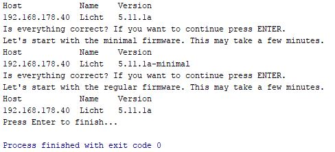

# Tasmota Firmware Updater
Script um alle eure Sonoff Geräte mit Tasmota Firmware auf einmal zu aktualisieren.

# Vor- und Nachteile
- Funktioniert ohne Internet
- klein und schlank
- kann nur Updaten; nicht mehr
- Python benötigt

# Voraussetzungen
- Python 3
- selbstcompilierte Firmwares (normal + minimal) mit WIFI_RETRY, euren Wlan-Daten und dem Webserver aktiviert

# Anleitung
- Abhängigkeiten installieren: "pip install requests"
- settings.json öffnen und eure Zugangsdaten für jedes Gerät eingeben
- In den selben Ordner kopiert ihr eure Firmwares und benennt diese nach "firmware.bin" und "firmware-minimal.bin" um
- Datei "upgrade.py" ausführen und den Anweisungen folgen

# Instructions

- Install dependencies: "pip install requests"
- Edit settings.json; Enter your credentials for every firmware
- Copy into the same folder the firmware files and rename the files to "firmware.bin" and "firmware-minimal.bin"
- Execute "upgrade.py" and follow the instructions